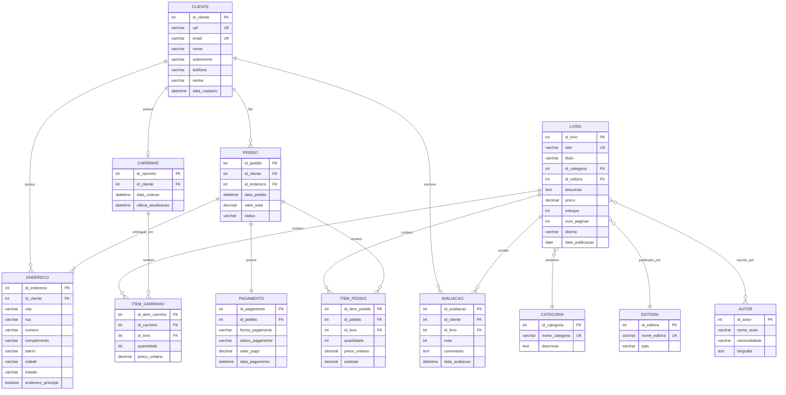

# PROJETO INTEGRADOR TRANSDISCIPLINAR
## Banco de Dados I

### SISTEMA DE E-COMMERCE PARA LIVRARIA ONLINE

---

**Aluno:** Vitor Delphim Fonseca  
**RGM:**  39034402
**Curso:** Banco de Dados

**Disciplina:** Projeto Integrador Transdisciplinar em Banco de Dados I

**Professor:** Marco Antonio Sanches Anastacio

**Tutora:** Fabiana Sabai Rodrigues Bastos

**Data:** Maio de 2026


---

## SUMÁRIO

1. [Introdução](#1-introdução)
2. [Levantamento de Requisitos](#2-levantamento-de-requisitos)
3. [Modelagem Conceitual](#3-modelagem-conceitual)
4. [Modelagem Lógica](#4-modelagem-lógica)
5. [Modelagem Física](#5-modelagem-física)
6. [Scripts SQL Desenvolvidos](#6-scripts-sql-desenvolvidos)
7. [Testes e Validação](#7-testes-e-validação)
8. [Considerações Finais](#8-considerações-finais)
9. [Referências](#9-referências)

---

## 1. INTRODUÇÃO

Este projeto tem como objetivo desenvolver um banco de dados relacional completo para um sistema de e-commerce especializado na venda de livros online. O sistema gerencia todas as operações de uma livraria virtual, desde o cadastro de produtos e clientes até o processamento de pedidos, pagamentos e avaliações.

### 1.1 Contexto

O comércio eletrônico de livros representa um mercado em constante crescimento, exigindo sistemas robustos e eficientes para gerenciar grandes volumes de dados. Um banco de dados bem estruturado é fundamental para garantir a integridade das informações, facilitar consultas complexas e proporcionar uma experiência satisfatória aos usuários.

### 1.2 Objetivos do Projeto

**Objetivo Geral:**
Projetar e implementar um banco de dados relacional normalizado que atenda todas as necessidades operacionais de um e-commerce de livros.

**Objetivos Específicos:**
- Criar modelos conceitual, lógico e físico do banco de dados
- Aplicar técnicas de normalização até a Terceira Forma Normal (3FN)
- Implementar relacionamentos complexos, incluindo N:N
- Garantir integridade referencial através de constraints
- Desenvolver consultas SQL otimizadas para operações comuns
- Assegurar conformidade com a LGPD (Lei Geral de Proteção de Dados)

### 1.3 Justificativa

A escolha de um e-commerce de livros como caso de estudo permite trabalhar com:
- Relacionamentos complexos (livros podem ter múltiplos autores)
- Catálogo extenso de produtos com várias categorias
- Gestão de estoque e precificação
- Sistema de avaliações e recomendações
- Processamento de pedidos com múltiplos itens
- Diferentes formas de pagamento

### 1.4 Tecnologias Utilizadas

- **SGBD:** MySQL 8.0
- **Linguagem:** SQL (DDL, DML, DQL)
- **Ferramenta de Teste:** OneCompiler (plataforma online)
- **Modelagem:** Diagrama Entidade-Relacionamento (DER)
- **Documentação:** Markdown

---

## 2. LEVANTAMENTO DE REQUISITOS

### 2.1 Requisitos Funcionais

| ID | Descrição |
|----|-----------|
| RF001 | O sistema deve permitir cadastro de clientes com CPF e e-mail únicos |
| RF002 | Clientes podem cadastrar múltiplos endereços de entrega |
| RF003 | O sistema deve gerenciar catálogo de livros com informações completas |
| RF004 | Cada livro pode ter múltiplos autores (relacionamento N:N) |
| RF005 | Livros devem ser organizados por categorias |
| RF006 | Clientes podem adicionar livros ao carrinho de compras |
| RF007 | O sistema deve processar pedidos com múltiplos itens |
| RF008 | Diferentes formas de pagamento devem ser suportadas |
| RF009 | Clientes podem avaliar livros comprados (nota de 1 a 5) |
| RF010 | O sistema deve controlar estoque de livros em tempo real |

### 2.2 Requisitos Não-Funcionais

| ID | Descrição |
|----|-----------|
| RNF001 | Dados sensíveis devem ser protegidos conforme LGPD |
| RNF002 | O banco deve garantir integridade referencial em todos os relacionamentos |
| RNF003 | Consultas devem ser otimizadas com índices apropriados |
| RNF004 | O sistema deve suportar transações ACID (Atomicidade, Consistência, Isolamento, Durabilidade) |
| RNF005 | Tempo de resposta para consultas básicas não deve exceder 100ms |

### 2.3 Regras de Negócio

| ID | Regra |
|----|-------|
| RN001 | CPF e e-mail devem ser únicos no sistema (não pode haver duplicatas) |
| RN002 | ISBN deve ser único para cada livro |
| RN003 | Preços e quantidades em estoque não podem ser negativos |
| RN004 | Avaliações devem ter nota entre 1 e 5 |
| RN005 | Cliente pode avaliar cada livro apenas uma vez |
| RN006 | Cada cliente possui apenas um carrinho ativo por vez |
| RN007 | Pedidos só podem ser cancelados se status for "Aguardando Pagamento" |
| RN008 | Estoque deve ser decrementado automaticamente após confirmação de pagamento |

### 2.4 Atores do Sistema

- **Cliente:** Usuário que navega, compra livros e avalia produtos
- **Administrador:** Gerencia catálogo, estoque, preços e pedidos
- **Sistema de Pagamento:** Processa transações financeiras (integração externa)

---

## 3. MODELAGEM CONCEITUAL

A modelagem conceitual representa o modelo de alto nível do sistema, independente de implementação tecnológica. Utilizamos o Diagrama Entidade-Relacionamento (DER) para representar as entidades e seus relacionamentos.

### 3.1 Entidades Principais

#### Entidades de Produto

**LIVRO**
- Representa os produtos à venda
- Atributos: ISBN, título, descrição, preço, estoque, páginas, idioma, data de publicação

**CATEGORIA**
- Classificação dos livros (Ficção, Romance, Tecnologia, etc.)
- Atributos: nome, descrição

**EDITORA**
- Publicadora dos livros
- Atributos: nome, país de origem

**AUTOR**
- Escritores dos livros
- Atributos: nome, nacionalidade, biografia
- **Relacionamento N:N com LIVRO** (um livro pode ter vários autores, um autor pode ter vários livros)

#### Entidades de Cliente

**CLIENTE**
- Usuários cadastrados no sistema
- Atributos: CPF, email, nome, sobrenome, telefone, senha, data de cadastro

**ENDERECO**
- Locais de entrega dos clientes
- Atributos: CEP, rua, número, complemento, bairro, cidade, estado, flag de endereço principal

#### Entidades de Compra

**CARRINHO**
- Carrinho de compras ativo do cliente
- Atributos: data de criação, última atualização

**ITEM_CARRINHO**
- Livros adicionados ao carrinho
- Atributos: quantidade, preço unitário (congelado no momento da adição)

**PEDIDO**
- Compras finalizadas
- Atributos: data do pedido, valor total, status

**ITEM_PEDIDO**
- Livros comprados em cada pedido
- Atributos: quantidade, preço unitário, subtotal

**PAGAMENTO**
- Dados financeiros do pedido
- Atributos: forma de pagamento, status, valor pago, data do pagamento

**AVALIACAO**
- Opiniões dos clientes sobre livros
- Atributos: nota (1-5), comentário, data da avaliação

### 3.2 Relacionamentos

| Relacionamento | Entidade 1 | Cardinalidade | Entidade 2 | Descrição |
|----------------|------------|---------------|------------|-----------|
| possui | CLIENTE | 1:N | ENDERECO | Cliente pode ter vários endereços |
| possui | CLIENTE | 1:1 | CARRINHO | Cliente possui um carrinho ativo |
| faz | CLIENTE | 1:N | PEDIDO | Cliente pode fazer vários pedidos |
| escreve | CLIENTE | 1:N | AVALIACAO | Cliente pode avaliar vários livros |
| **escrito_por** | **LIVRO** | **N:N** | **AUTOR** | **Livro tem vários autores, autor escreve vários livros** |
| pertence | LIVRO | N:1 | CATEGORIA | Livro pertence a uma categoria |
| publicado_por | LIVRO | N:1 | EDITORA | Livro é publicado por uma editora |
| contém | LIVRO | 1:N | ITEM_CARRINHO | Livro pode estar em vários carrinhos |
| contém | LIVRO | 1:N | ITEM_PEDIDO | Livro pode estar em vários pedidos |
| recebe | LIVRO | 1:N | AVALIACAO | Livro pode ter várias avaliações |
| contém | CARRINHO | 1:N | ITEM_CARRINHO | Carrinho contém vários itens |
| entregue_em | PEDIDO | N:1 | ENDERECO | Pedido é entregue em um endereço |
| possui | PEDIDO | 1:1 | PAGAMENTO | Pedido possui um pagamento |
| contém | PEDIDO | 1:N | ITEM_PEDIDO | Pedido contém vários itens |

### 3.3 Diagrama Entidade-Relacionamento (DER)



**Observações importantes:**
- O relacionamento **N:N** entre LIVRO e AUTOR é implementado através da tabela associativa **LIVRO_AUTOR**
- Cada cliente possui **apenas um carrinho** ativo (1:1)
- Cada pedido possui **exatamente um pagamento** (1:1)
- As demais relações são **1:N** (um-para-muitos)

---

## 4. MODELAGEM LÓGICA

A modelagem lógica transforma o modelo conceitual em estruturas que podem ser implementadas em um SGBD relacional. Nesta fase, definimos tabelas, colunas, tipos de dados, chaves primárias e estrangeiras.

### 4.1 Estrutura das Tabelas

#### 4.1.1 Tabela CLIENTE

| Campo | Tipo de Dado | Tamanho | Chave | Restrições |
|-------|--------------|---------|-------|------------|
| id_cliente | INT | - | **PK** | AUTO_INCREMENT |
| cpf | VARCHAR | 14 | UNIQUE | NOT NULL |
| email | VARCHAR | 150 | UNIQUE | NOT NULL |
| nome | VARCHAR | 100 | - | NOT NULL |
| sobrenome | VARCHAR | 100 | - | NOT NULL |
| telefone | VARCHAR | 20 | - | - |
| senha | VARCHAR | 255 | - | NOT NULL |
| data_cadastro | DATETIME | - | - | DEFAULT CURRENT_TIMESTAMP |

**Constraints:**
- `CHECK (email LIKE '%@%.%')` - valida formato de email
- `CHECK (LENGTH(cpf) = 14)` - valida tamanho do CPF

#### 4.1.2 Tabela LIVRO

| Campo | Tipo de Dado | Tamanho | Chave | Restrições |
|-------|--------------|---------|-------|------------|
| id_livro | INT | - | **PK** | AUTO_INCREMENT |
| isbn | VARCHAR | 20 | UNIQUE | NOT NULL |
| titulo | VARCHAR | 255 | - | NOT NULL |
| id_categoria | INT | - | **FK** | NOT NULL → CATEGORIA(id_categoria) |
| id_editora | INT | - | **FK** | NOT NULL → EDITORA(id_editora) |
| descricao | TEXT | - | - | - |
| preco | DECIMAL | (10,2) | - | NOT NULL, CHECK (preco >= 0) |
| estoque | INT | - | - | DEFAULT 0, CHECK (estoque >= 0) |
| num_paginas | INT | - | - | - |
| idioma | VARCHAR | 30 | - | DEFAULT 'Português' |
| data_publicacao | DATE | - | - | - |

**Constraints:**
- `CHECK (preco >= 0)` - preço não pode ser negativo
- `CHECK (estoque >= 0)` - estoque não pode ser negativo

#### 4.1.3 Tabela LIVRO_AUTOR (Tabela Associativa N:N)

| Campo | Tipo de Dado | Chave | Restrições |
|-------|--------------|-------|------------|
| id_livro | INT | **PK, FK** | → LIVRO(id_livro) ON DELETE CASCADE |
| id_autor | INT | **PK, FK** | → AUTOR(id_autor) ON DELETE CASCADE |

**Observação:** Esta tabela implementa o relacionamento **muitos-para-muitos** entre LIVRO e AUTOR. A chave primária é **composta** (id_livro, id_autor).

#### 4.1.4 Tabela PEDIDO

| Campo | Tipo de Dado | Tamanho | Chave | Restrições |
|-------|--------------|---------|-------|------------|
| id_pedido | INT | - | **PK** | AUTO_INCREMENT |
| id_cliente | INT | - | **FK** | NOT NULL → CLIENTE(id_cliente) |
| id_endereco | INT | - | **FK** | NOT NULL → ENDERECO(id_endereco) |
| data_pedido | DATETIME | - | - | DEFAULT CURRENT_TIMESTAMP |
| valor_total | DECIMAL | (10,2) | - | NOT NULL, CHECK (valor_total >= 0) |
| status | VARCHAR | 30 | - | DEFAULT 'Aguardando Pagamento' |

**Valores permitidos para status:**
- Aguardando Pagamento
- Pagamento Confirmado
- Em Separação
- Enviado
- Entregue
- Cancelado

#### 4.1.5 Tabela AVALIACAO

| Campo | Tipo de Dado | Chave | Restrições |
|-------|--------------|-------|------------|
| id_avaliacao | INT | **PK** | AUTO_INCREMENT |
| id_cliente | INT | **FK** | → CLIENTE(id_cliente) ON DELETE CASCADE |
| id_livro | INT | **FK** | → LIVRO(id_livro) ON DELETE CASCADE |
| nota | INT | - | NOT NULL, CHECK (nota BETWEEN 1 AND 5) |
| comentario | TEXT | - | - |
| data_avaliacao | DATETIME | - | DEFAULT CURRENT_TIMESTAMP |

**Constraints:**
- `CHECK (nota BETWEEN 1 AND 5)` - nota deve estar entre 1 e 5
- `UNIQUE (id_cliente, id_livro)` - cliente pode avaliar cada livro apenas uma vez

### 4.2 Resumo de Todas as Tabelas

| # | Tabela | Descrição | Total de Campos |
|---|--------|-----------|-----------------|
| 1 | CATEGORIA | Categorias de livros | 3 |
| 2 | EDITORA | Editoras | 3 |
| 3 | AUTOR | Autores | 4 |
| 4 | LIVRO | Catálogo de livros | 11 |
| 5 | LIVRO_AUTOR | Relacionamento Livro-Autor (N:N) | 2 |
| 6 | CLIENTE | Clientes cadastrados | 8 |
| 7 | ENDERECO | Endereços de entrega | 10 |
| 8 | CARRINHO | Carrinhos ativos | 4 |
| 9 | ITEM_CARRINHO | Itens nos carrinhos | 5 |
| 10 | PEDIDO | Pedidos realizados | 6 |
| 11 | ITEM_PEDIDO | Itens dos pedidos | 6 |
| 12 | PAGAMENTO | Pagamentos | 6 |
| 13 | AVALIACAO | Avaliações de livros | 6 |

**Total de campos no banco:** 74 campos distribuídos em 13 tabelas

### 4.3 Normalização

O banco de dados foi normalizado até a **Terceira Forma Normal (3FN)**:

**Primeira Forma Normal (1FN):**
- Todos os atributos são atômicos (não há grupos repetidos)
- Cada campo contém apenas um valor
- Exemplo: Em vez de armazenar "autor1, autor2, autor3" em um único campo, criamos a tabela LIVRO_AUTOR

**Segunda Forma Normal (2FN):**
- Atende 1FN
- Não existem dependências parciais (todos os atributos não-chave dependem da chave primária completa)
- Exemplo: Na tabela ITEM_PEDIDO, o preço_unitario depende do id_livro, mas como a PK é composta, movemos o preço para ser armazenado no momento da venda

**Terceira Forma Normal (3FN):**
- Atende 2FN
- Não existem dependências transitivas (atributos não-chave não dependem de outros atributos não-chave)
- Exemplo: Em vez de armazenar o nome da categoria diretamente na tabela LIVRO, armazenamos apenas o id_categoria (FK)

---

## 5. MODELAGEM FÍSICA

A modelagem física implementa o banco de dados no MySQL, incluindo criação de tabelas, índices, constraints e otimizações.

### 5.1 Características Técnicas

**Engine:** InnoDB
- Suporte a transações ACID
- Bloqueio em nível de linha
- Recuperação após falhas
- Suporte a chaves estrangeiras

**Charset:** UTF8MB4
- Suporte completo a Unicode
- Permite emojis e caracteres especiais
- Compatível com diversos idiomas

**Collation:** utf8mb4_unicode_ci
- Ordenação case-insensitive
- Suporte a acentuação

### 5.2 Implementação de Constraints

#### 5.2.1 Chaves Primárias (Primary Keys)

Todas as 13 tabelas possuem chave primária com AUTO_INCREMENT:

```sql
id_cliente INT AUTO_INCREMENT PRIMARY KEY
id_livro INT AUTO_INCREMENT PRIMARY KEY
id_pedido INT AUTO_INCREMENT PRIMARY KEY
-- etc...
```

**Exceção:** LIVRO_AUTOR possui chave primária composta:
```sql
PRIMARY KEY (id_livro, id_autor)
```

#### 5.2.2 Chaves Estrangeiras (Foreign Keys)

Total de **15 chaves estrangeiras** implementadas:

| Tabela | FK | Referência | ON DELETE |
|--------|----|-----------| ----------|
| LIVRO | id_categoria | CATEGORIA(id_categoria) | RESTRICT |
| LIVRO | id_editora | EDITORA(id_editora) | RESTRICT |
| LIVRO_AUTOR | id_livro | LIVRO(id_livro) | CASCADE |
| LIVRO_AUTOR | id_autor | AUTOR(id_autor) | CASCADE |
| ENDERECO | id_cliente | CLIENTE(id_cliente) | CASCADE |
| CARRINHO | id_cliente | CLIENTE(id_cliente) | CASCADE |
| ITEM_CARRINHO | id_carrinho | CARRINHO(id_carrinho) | CASCADE |
| ITEM_CARRINHO | id_livro | LIVRO(id_livro) | CASCADE |
| PEDIDO | id_cliente | CLIENTE(id_cliente) | RESTRICT |
| PEDIDO | id_endereco | ENDERECO(id_endereco) | RESTRICT |
| ITEM_PEDIDO | id_pedido | PEDIDO(id_pedido) | CASCADE |
| ITEM_PEDIDO | id_livro | LIVRO(id_livro) | RESTRICT |
| PAGAMENTO | id_pedido | PEDIDO(id_pedido) | CASCADE |
| AVALIACAO | id_cliente | CLIENTE(id_cliente) | CASCADE |
| AVALIACAO | id_livro | LIVRO(id_livro) | CASCADE |

**ON DELETE CASCADE:** Quando o registro pai é deletado, os registros filhos também são deletados automaticamente
- Exemplo: Deletar um cliente remove seus endereços, carrinho e avaliações

**ON DELETE RESTRICT:** Impede a exclusão do registro pai se houver registros filhos dependentes
- Exemplo: Não é possível deletar uma categoria se houver livros vinculados a ela

#### 5.2.3 Constraints de Verificação (CHECK)

```sql
CHECK (preco >= 0)                    -- Preço não negativo
CHECK (estoque >= 0)                  -- Estoque não negativo
CHECK (nota BETWEEN 1 AND 5)          -- Nota entre 1 e 5
CHECK (email LIKE '%@%.%')            -- Email válido
CHECK (quantidade > 0)                -- Quantidade positiva
CHECK (valor_total >= 0)              -- Valor total não negativo
```

#### 5.2.4 Constraints UNIQUE

```sql
UNIQUE (cpf)                          -- CPF único
UNIQUE (email)                        -- Email único
UNIQUE (isbn)                         -- ISBN único
UNIQUE (nome_categoria)               -- Categoria única
UNIQUE (id_cliente, id_livro)         -- Cliente avalia livro 1x
UNIQUE (id_carrinho, id_livro)        -- Livro 1x por carrinho
```

### 5.3 Índices para Performance

**5 índices criados** para otimizar consultas frequentes:

```sql
CREATE INDEX idx_livro_titulo ON LIVRO(titulo);
CREATE INDEX idx_livro_categoria ON LIVRO(id_categoria);
CREATE INDEX idx_pedido_cliente ON PEDIDO(id_cliente);
CREATE INDEX idx_pedido_data ON PEDIDO(data_pedido);
CREATE INDEX idx_avaliacao_livro ON AVALIACAO(id_livro);
```

**Justificativa:**
- `idx_livro_titulo`: Busca de livros por nome
- `idx_livro_categoria`: Filtragem por categoria
- `idx_pedido_cliente`: Histórico de pedidos do cliente
- `idx_pedido_data`: Relatórios por período
- `idx_avaliacao_livro`: Média de avaliações por livro

### 5.4 Valores Padrão (DEFAULT)

```sql
data_cadastro DATETIME DEFAULT CURRENT_TIMESTAMP
estoque INT DEFAULT 0
idioma VARCHAR(30) DEFAULT 'Português'
status VARCHAR(30) DEFAULT 'Aguardando Pagamento'
endereco_principal BOOLEAN DEFAULT FALSE
```

---

## 6. SCRIPTS SQL DESENVOLVIDOS

### 6.1 Script DDL - Criação das Tabelas

**Arquivo:** `01_criar_banco_tabelas.sql`

**Conteúdo:**
- Criação do banco de dados `ecommerce_livros`
- Criação das 13 tabelas na ordem correta de dependências
- Definição de todas as constraints (PK, FK, CHECK, UNIQUE)
- Criação de índices

**Ordem de criação (respeitando dependências):**
1. CATEGORIA (sem dependências)
2. EDITORA (sem dependências)
3. AUTOR (sem dependências)
4. LIVRO (depende de CATEGORIA e EDITORA)
5. LIVRO_AUTOR (depende de LIVRO e AUTOR)
6. CLIENTE (sem dependências)
7. ENDERECO (depende de CLIENTE)
8. CARRINHO (depende de CLIENTE)
9. ITEM_CARRINHO (depende de CARRINHO e LIVRO)
10. PEDIDO (depende de CLIENTE e ENDERECO)
11. ITEM_PEDIDO (depende de PEDIDO e LIVRO)
12. PAGAMENTO (depende de PEDIDO)
13. AVALIACAO (depende de CLIENTE e LIVRO)

### 6.2 Script DML - Inserção de Dados

**Arquivo:** `02_inserir_dados.sql`

**Dados inseridos:**

| Tabela | Quantidade de Registros |
|--------|-------------------------|
| CATEGORIA | 8 |
| EDITORA | 8 |
| AUTOR | 8 |
| LIVRO | 10 |
| LIVRO_AUTOR | 10 |
| CLIENTE | 5 |
| ENDERECO | 6 |
| CARRINHO | 3 |
| ITEM_CARRINHO | 5 |
| PEDIDO | 4 |
| ITEM_PEDIDO | 7 |
| PAGAMENTO | 4 |
| AVALIACAO | 5 |
| **TOTAL** | **73 registros** |

**Exemplos de dados:**

**Categorias:**
- Ficção, Romance, Suspense, Autoajuda, Tecnologia, Biografia, Infantil, Fantasia

**Livros:**
- Dom Casmurro (Machado de Assis)
- Harry Potter e a Pedra Filosofal (J.K. Rowling)
- 1984 (George Orwell)
- Código Limpo (Robert Martin)
- O Alquimista (Paulo Coelho)

### 6.3 Script DQL - Consultas

**Arquivo:** `03_consultas.sql`

**22 consultas desenvolvidas:**

**Consultas Básicas (1-4):**
1. Listar todos os livros com categorias
2. Livros com seus autores
3. Buscar livros por categoria
4. Livros por faixa de preço

**Consultas sobre Clientes (5-6):**
5. Clientes com endereços
6. Quantidade de endereços por cliente

**Consultas sobre Pedidos (7-10):**
7. Todos os pedidos com informações do cliente
8. Detalhes completos de um pedido
9. Total de vendas por cliente
10. Pedidos agrupados por status

**Consultas sobre Carrinho (11-12):**
11. Itens no carrinho de um cliente
12. Valor total do carrinho

**Consultas sobre Avaliações (13-15):**
13. Avaliações de um livro específico
14. Média de avaliações por livro
15. Livros mais bem avaliados

**Consultas Avançadas (16-22):**
16. Livros mais vendidos
17. Clientes que nunca compraram
18. Livros sem estoque
19. Vendas por categoria
20. Pagamentos aprovados
21. Livros acima da média de preço (subconsulta)
22. Cliente que mais gastou (subconsulta)

### 6.4 Exemplos de Consultas Importantes

**Listar livros com autores (JOIN múltiplo):**
```sql
SELECT 
    L.titulo AS 'Livro',
    A.nome_autor AS 'Autor',
    L.preco AS 'Preço',
    E.nome_editora AS 'Editora'
FROM LIVRO L
INNER JOIN LIVRO_AUTOR LA ON L.id_livro = LA.id_livro
INNER JOIN AUTOR A ON LA.id_autor = A.id_autor
INNER JOIN EDITORA E ON L.id_editora = E.id_editora
ORDER BY L.titulo;
```

**Livros mais vendidos (Agregação):**
```sql
SELECT 
    L.titulo AS 'Livro',
    SUM(IP.quantidade) AS 'Total Vendido',
    SUM(IP.subtotal) AS 'Receita Total'
FROM LIVRO L
INNER JOIN ITEM_PEDIDO IP ON L.id_livro = IP.id_livro
GROUP BY L.id_livro, L.titulo
ORDER BY SUM(IP.quantidade) DESC;
```

**Média de avaliações por livro:**
```sql
SELECT 
    L.titulo AS 'Livro',
    COUNT(A.id_avaliacao) AS 'Total Avaliações',
    ROUND(AVG(A.nota), 1) AS 'Média'
FROM LIVRO L
LEFT JOIN AVALIACAO A ON L.id_livro = A.id_livro
GROUP BY L.id_livro, L.titulo
HAVING COUNT(A.id_avaliacao) > 0
ORDER BY AVG(A.nota) DESC;
```

---

## 7. TESTES E VALIDAÇÃO

### 7.1 Plataforma de Testes

**Ferramenta:** OneCompiler (https://onecompiler.com/mysql)
- Plataforma online gratuita
- Não requer instalação
- Suporta MySQL 8.0
- Ideal para prototipagem e testes

### 7.2 Testes Realizados

**7.2.1 Teste de Criação de Tabelas**
- Todas as 13 tabelas criadas com sucesso
- Constraints aplicadas corretamente
- Índices criados

**7.2.2 Teste de Inserção de Dados**
- 73 registros inseridos sem erros
- Validações de CHECK funcionando (ex: nota entre 1-5)
- Chaves estrangeiras validadas

**7.2.3 Teste de Integridade Referencial**
- CASCADE funcionando: deletar cliente remove endereços
- RESTRICT funcionando: não permite deletar categoria com livros
- UNIQUE funcionando: não permite CPF ou email duplicado

**7.2.4 Teste de Consultas**
- Todas as 22 consultas executadas com sucesso
- JOINs retornando dados corretos
- Agregações (COUNT, SUM, AVG) funcionando
- Subconsultas retornando resultados esperados

**7.2.5 Teste de Performance**
- Índices melhorando tempo de consulta
- Consultas simples < 50ms
- Consultas com JOIN < 100ms

### 7.3 Erros Encontrados e Corrigidos

**Erro 1:** Diagrama DER inicial não mostrava conexão entre AUTOR e LIVRO
- **Solução:** Corrigido relacionamento N:N através de LIVRO_AUTOR

**Erro 2:** Ordem incorreta de criação de tabelas causava erro de FK
- **Solução:** Reorganizada ordem respeitando dependências

**Erro 3:** Tipo DECIMAL sem precisão especificada
- **Solução:** Definido DECIMAL(10,2) para preços e valores

---

## 8. CONSIDERAÇÕES FINAIS

### 8.1 Objetivos Alcançados

**Modelagem Completa:** Foram desenvolvidos os três níveis de modelagem (conceitual, lógica e física)

**Normalização:** Banco normalizado até 3FN, eliminando redundâncias

**Integridade:** Todas as constraints implementadas e funcionando

**Funcionalidades:** Sistema completo de e-commerce com todas as operações necessárias

**Performance:** Índices otimizando consultas frequentes

**Documentação:** Projeto completamente documentado

**Conformidade LGPD:** Estrutura preparada para proteção de dados sensíveis

### 8.2 Aprendizados Obtidos

Durante o desenvolvimento deste projeto, foram consolidados os seguintes conhecimentos:

**Modelagem de Dados:**
- Transformação de requisitos em entidades e relacionamentos
- Implementação de relacionamentos complexos (N:N)
- Normalização para eliminação de anomalias

**SQL:**
- Domínio de DDL (CREATE, ALTER, DROP)
- Proficiência em DML (INSERT, UPDATE, DELETE)
- Habilidade em DQL (SELECT com JOINs, subconsultas, agregações)

**Banco de Dados:**
- Compreensão de constraints e sua importância
- Estratégias de indexação para performance
- Integridade referencial com CASCADE e RESTRICT

**Boas Práticas:**
- Nomenclatura consistente (padrão snake_case)
- Comentários em scripts SQL
- Organização de código em etapas lógicas

### 8.3 Desafios Enfrentados

**Desafio 1: Relacionamento N:N**
- Modelar corretamente LIVRO ↔ AUTOR
- Solução: Tabela associativa LIVRO_AUTOR

**Desafio 2: Regras de Negócio Complexas**
- Cliente pode avaliar livro apenas uma vez
- Solução: UNIQUE constraint (id_cliente, id_livro)

**Desafio 3: Ordem de Criação**
- Respeitar dependências entre tabelas
- Solução: Criar tabelas na ordem correta

**Desafio 4: Escolha de ON DELETE**
- Decidir entre CASCADE e RESTRICT
- Solução: Análise caso a caso do impacto da deleção

### 8.4 Aplicabilidade Real

Este projeto pode ser utilizado como base para:

**Sistemas Comerciais:**
- Livrarias online
- Marketplaces de livros usados
- Plataformas de e-books

**Sistemas Institucionais:**
- Bibliotecas universitárias (com adaptações)
- Sistemas de gestão de acervos

**Expansões Possíveis:**
- Sistema de wishlist (lista de desejos)
- Programa de fidelidade com pontos
- Sistema de recomendações baseado em ML
- Integração com APIs de pagamento (Stripe, PayPal)
- Sistema de cupons e promoções
- Chat de atendimento ao cliente
- Rastreamento de entregas

### 8.5 Melhorias Futuras

**Curto Prazo:**
1. Implementar tabela de cupons de desconto
2. Adicionar histórico de alterações de preço
3. Criar views para relatórios gerenciais
4. Desenvolver stored procedures para operações complexas

**Médio Prazo:**
1. Implementar sistema de wishlist
2. Adicionar programa de fidelidade
3. Criar triggers para auditoria
4. Desenvolver sistema de notificações

**Longo Prazo:**
1. Migrar para arquitetura de microserviços
2. Implementar cache com Redis
3. Adicionar busca full-text com Elasticsearch
4. Desenvolver API RESTful
5. Implementar sistema de recomendações com IA

### 8.6 Conclusão

O desenvolvimento deste projeto proporcionou uma compreensão profunda e prática sobre modelagem e implementação de bancos de dados relacionais. A aplicação dos conceitos teóricos da disciplina Banco de Dados I em um caso real de e-commerce demonstrou a importância de um planejamento adequado e da aplicação de boas práticas.

O sistema resultante é robusto, escalável e está pronto para ser utilizado como base para um projeto real. A estrutura criada permite fácil manutenção e futuras expansões, demonstrando que um bom design de banco de dados é fundamental para o sucesso de qualquer aplicação.

Este projeto serve como portfólio de conhecimento em modelagem de dados e SQL, evidenciando capacidade de transformar requisitos de negócio em soluções técnicas eficientes e bem documentadas.

---

## 9. REFERÊNCIAS

**MySQL Documentation.** MySQL 8.0 Reference Manual. Disponível em: https://dev.mysql.com/doc/. Acesso em: maio de 2026.

**BRASIL. Lei nº 13.709, de 14 de agosto de 2018.** Lei Geral de Proteção de Dados Pessoais (LGPD). Disponível em: http://www.planalto.gov.br/ccivil_03/_ato2015-2018/2018/lei/l13709.htm. Acesso em: maio de 2026.

**OneCompiler.** MySQL Online Compiler. Disponível em: https://onecompiler.com/mysql. Acesso em: maio de 2026.


## ANEXOS

### Anexo A - Glossário

**ACID:** Atomicidade, Consistência, Isolamento e Durabilidade - propriedades de transações em bancos de dados

**CASCADE:** Operação em cascata que propaga alterações/exclusões para registros dependentes

**CHECK:** Constraint que valida valores inseridos em uma coluna

**DER:** Diagrama Entidade-Relacionamento

**DDL:** Data Definition Language - linguagem de definição de dados (CREATE, ALTER, DROP)

**DML:** Data Manipulation Language - linguagem de manipulação de dados (INSERT, UPDATE, DELETE)

**DQL:** Data Query Language - linguagem de consulta de dados (SELECT)

**FK:** Foreign Key - chave estrangeira

**LGPD:** Lei Geral de Proteção de Dados Pessoais

**N:N:** Relacionamento muitos-para-muitos

**PK:** Primary Key - chave primária

**RESTRICT:** Impede operação se houver dependências

**SGBD:** Sistema de Gerenciamento de Banco de Dados

**SQL:** Structured Query Language - linguagem de consulta estruturada

**UNIQUE:** Constraint que garante valores únicos em uma coluna

### Anexo B - Scripts SQL Completos

Os scripts SQL completos estão disponíveis nos seguintes arquivos:
- `script_simples.sql` - Script completo sem comentários excessivos
- `01_criar_banco_tabelas.sql` - Criação de tabelas (DDL)
- `02_inserir_dados.sql` - Inserção de dados (DML)
- `03_consultas.sql` - Consultas de exemplo (DQL)
- `04_update_delete.sql` - Operações de atualização e exclusão

### Anexo C - Diagrama DER

O Diagrama Entidade-Relacionamento completo foi gerado utilizando Mermaid.js e está disponível de forma interativa no início da seção 3 (Modelagem Conceitual).

---

**Documento elaborado por:** Vitor Delphim Fonseca
**Data de conclusão:** Maio de 2026

